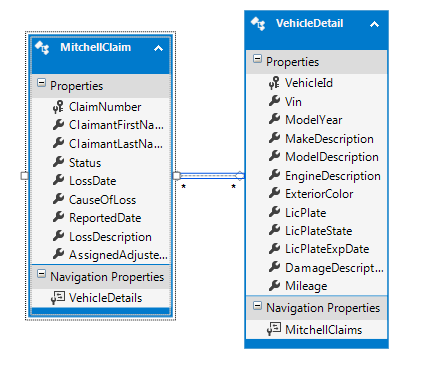

# Claims

### Setup

Solution was compiled using [Microsoft Visual Studio 2013 for Web](https://www.microsoft.com/en-us/download/details.aspx?id=44912)

### Technologies Used

[ASP.NET Web API](http://www.asp.net/web-api) - create web service

[Entity Framework](http://www.asp.net/entity-framework) - handle database access

[Web API Help Page](http://blogs.msdn.com/b/yaohuang1/archive/2012/08/15/introducing-the-asp-net-web-api-help-page-preview.aspx) - generates documentation for API

[Web API Test Client](https://github.com/yaohuang/WebApiTestClient) - allows easy testing from API Help pages

[Moq](https://github.com/Moq/moq4) - mocking objects for testing

### Data Model

Note: The Claims and Vehicles have a many-to-many relationship since a claim can have multiple vehicles involved, and I assumed that a vehicle can be listed under multiple claims.

